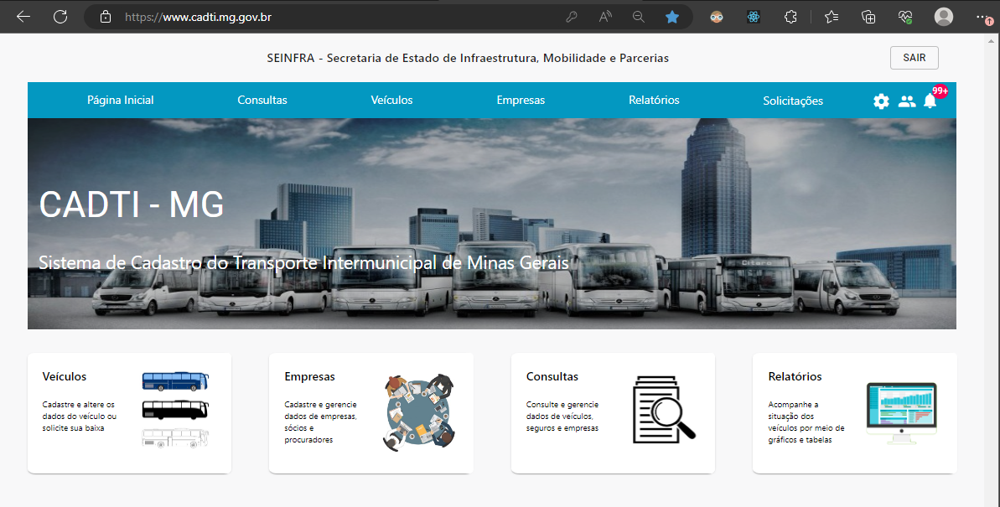
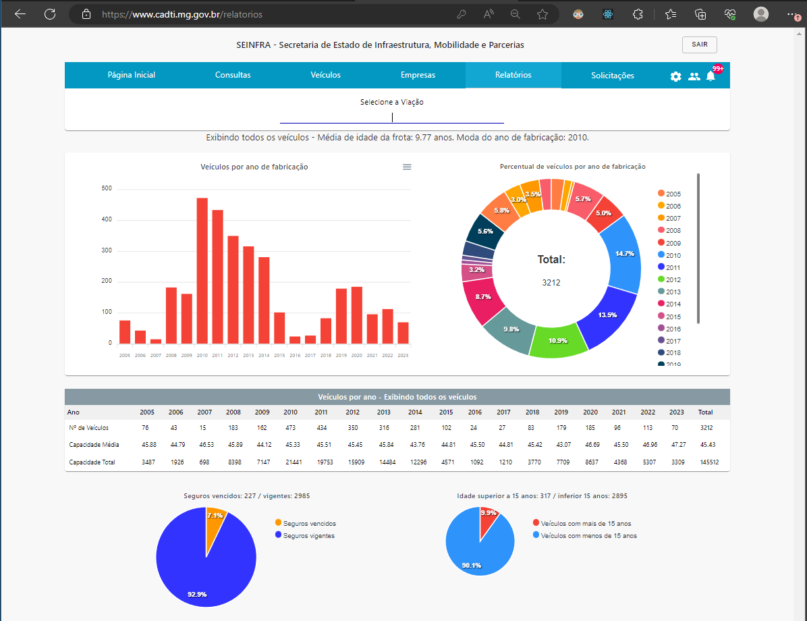
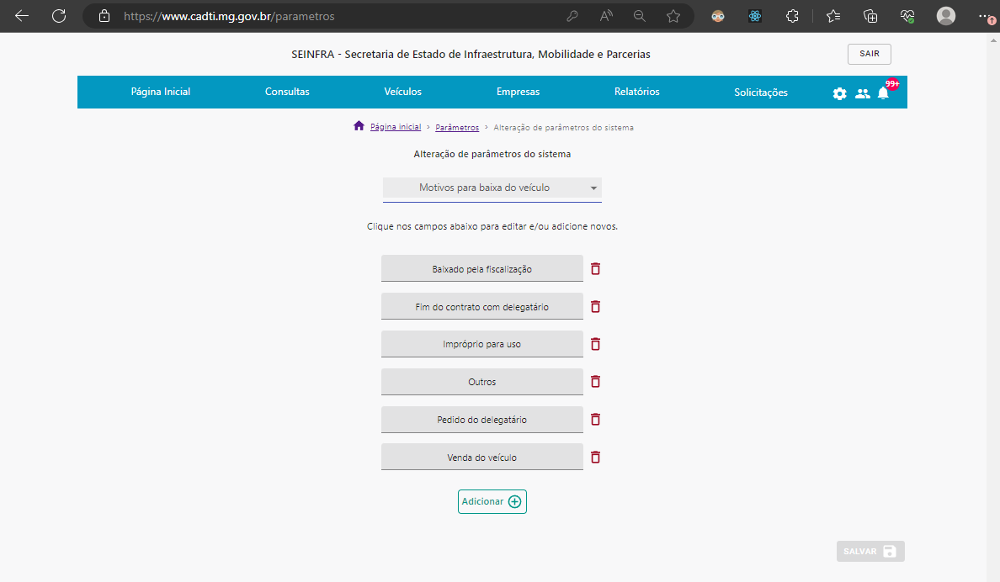
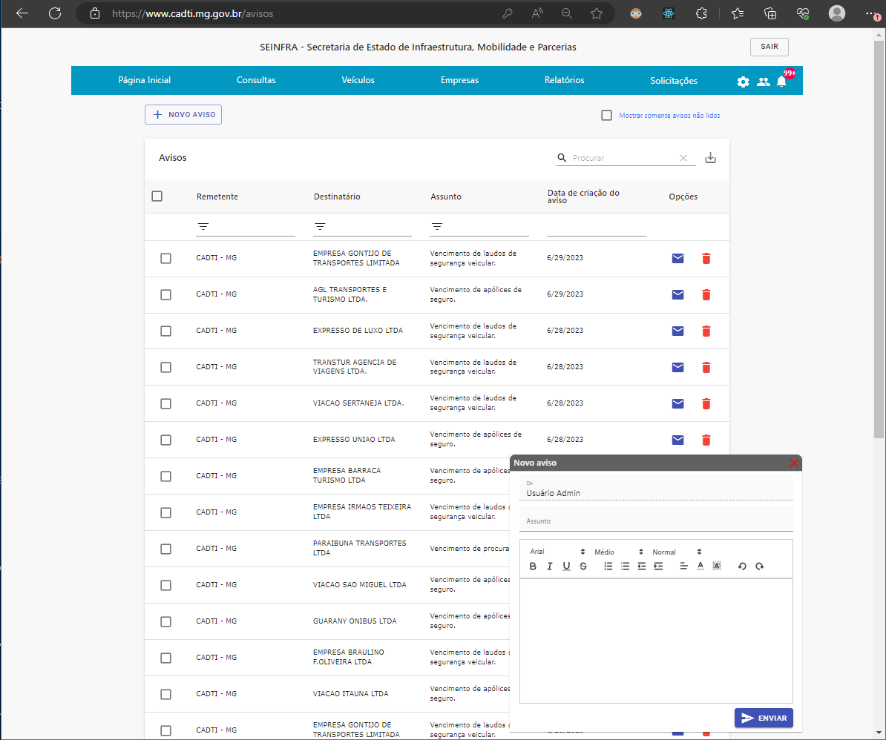

# Sistema de Gestão do Cadastro do Transporte Intermunicipal - CADTI / MG

O sistema CADTI, da Secretaria de Estado de Infraestrutra, Mobilidade e Parcerias, é um sistema em implementação que visa a gestão do cadastro de veículos, seguros, laudos, empresas, procuradores e sócios do transporte intermunicipal de Minas Gerais.

Além de possibilitar o cadastro, leitura, atualização e remoção de veículos, procuradores e empresas, o sistema possibilita a visualização de relatórios, a alteração de parâmetros e regras de negócio do próprio sistema e a geração automática / criação de avisos às empresas/delegatários. O sistema possui mecanismos automáticos de envio de e-mail/notificações e é sincronizado diariamente com o SGTI.

## Sumário

1. [Instalação](#1-instalação)
2. [Screenshots](#2-screenshots)  
   2.1. [Tela inicial](#21-tela-inicial)  
   2.2. [Relatórios](#22-relatórios)  
   2.3. [Parametros](#23-parâmetros-do-sistema)  
   2.4. [Avisos](#24-avisos)
3. [Diagramas C4](#3-diagramas-c4)  
   3.1. [Diagrama de Contexto](#31-diagrama-de-contexto)  
   3.2. [Diagrama de Container](#32-diagrama-de-container)  
   3.3. [Diagrama de Componente Backend](#33-diagrama-de-componente-backend)  
   3.4. [Diagrama de Componente Frontend](#34-diagrama-de-componente-frontend)  
4. [Documentação OpenAPI](#4-documentação-openapi)

## 1. Instalação

Para rodar o sistema:

- Faça o fork/clone do repositório para a máquina de destino
- Instale as dependências ( npm install )
- Execute o build do client (cd client && npm i && npm run build)
- Configure as variáveis de ambiente (ver arquivo envKeys.env na pasta raiz do projeto)
- Inicialize o docker-compose (comando: docker compose up)

Após esses passos, o sistema estará disponível em localhost:3001. É necessário criar um usuário para acessar o sistema.

## 2. Screenshots

### 2.1 Tela inicial

### 2.2 Relatórios

### 2.3 Parâmetros do sistema

### 2.4 Avisos

## 3. Diagramas C4

### 3.1 Diagrama de Contexto

### 3.2 Diagrama de Container

### 3.3 Diagrama de Componente Backend

### 3.4 Diagrama de Componente Frontend

## 4. Documentação OpenAPI

A documentação do REST API está disponível na versão OpenAPI 3. [Clique aqui para acessar a documentação](https://app.swaggerhub.com/apis-docs/sandroverissimo/cad-ti_api/3.1.2)
